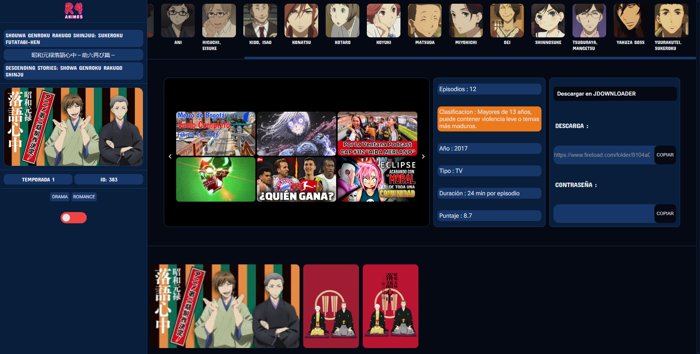
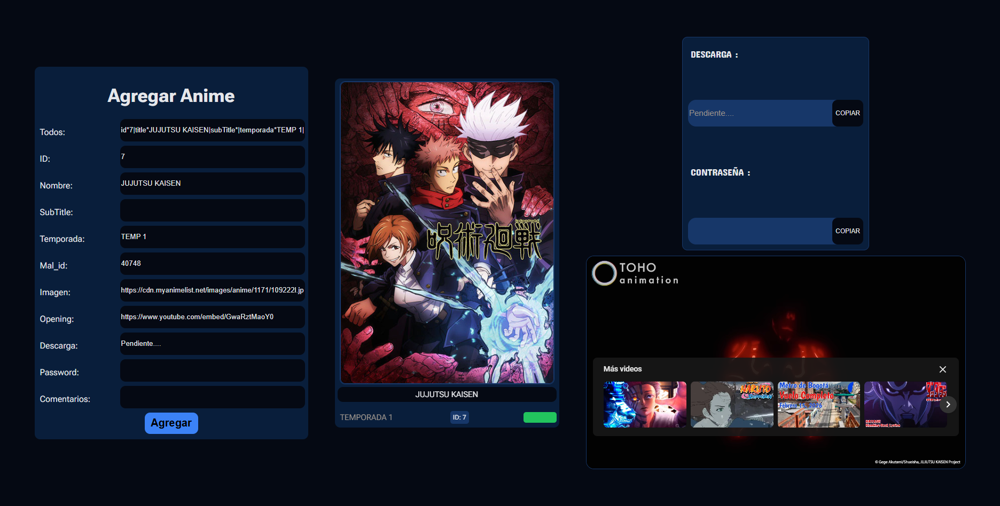
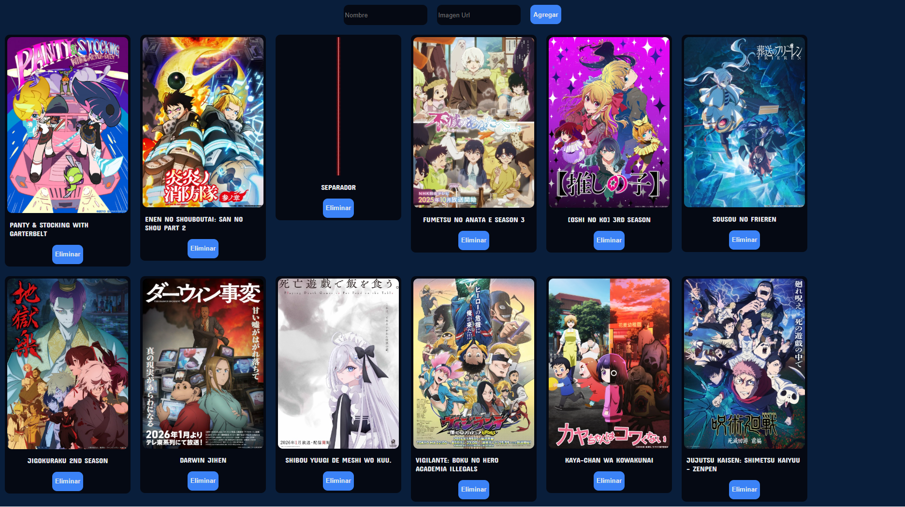

# R4 Animes - Plataforma de Gestión de Catálogo

**R4 Animes** es una aplicación web SPA (Single Page Application) desarrollada con **React**, diseñada para entusiastas del anime que desean gestionar su lista de series vistas, explorar nuevos títulos y acceder a información detallada de descarga y multimedia.

---

## 📸 Capturas del Proyecto

| Vista Principal (Catálogo) | Detalle de Anime (Multimedia & Descarga) | Agregar Anime | Agregar Proximo Anime |
| :---: | :---: | :---: | :---: |
|  |  |   |   | 
---

## 🚀 Características Principales

* **Banner Dinámico:** Un carrusel superior que muestra los "Próximos Animes" con movimiento infinito de izquierda a derecha.
* **Gestión de Estado:** Posibilidad de marcar animes como "Visto" (verde) o "No Visto" (rojo) directamente desde la interfaz.
* **Integración con Jikan API:** Extracción automática de datos técnicos, personajes, imágenes y openings.
* **Filtros Inteligentes:** Sidebar izquierdo con buscador funcional y filtros por categorías.
* **Sección de Descargas:** Panel dedicado con integración para copiar enlaces de JDownloader y contraseñas.
* **Administración:** Rutas exclusivas para agregar nuevo contenido al catálogo o al banner de próximos.

---

## 🛠️ Stack Tecnológico

* **Frontend:** React.js (Hooks, Context/State Management).
* **Estilos:** CSS Puro mediante **CSS Modules** (`.module.css`).
* **Base de Datos:** Firebase (Firestore) con colecciones para `Animes`, `Usuarios` y `Proximos`.
* **Tipado:** Interfaces personalizadas en `src/interfaces` para asegurar la integridad de los datos de Jikan y Firebase.

---

## ⚙️ Instalación

Para replicar este proyecto localmente, sigue estos pasos:

1.  **Clonar el repositorio:**
    ```bash
    git clone [https://github.com/tu-usuario/r4-animes.git](https://github.com/tu-usuario/r4-animes.git)
    cd r4-animes
    ```

2.  **Instalar dependencias:**
    Este comando instalará todas las librerías necesarias, incluyendo `firebase`, `react-router-dom`, y los módulos de Node.
    ```bash
    npm install
    ```

3.  **Configurar Firebase:**
    Asegúrate de configurar tus credenciales en el archivo de inicialización de Firebase utilizando el siguiente formato de cuenta de servicio:

    ```json
    {
      "type": "service_account",
      "project_id": "TU_PROJECT_ID",
      "private_key_id": "TU_PRIVATE_KEY_ID",
      "private_key": "TU_PRIVATE_KEY",
      "client_email": "TU_CLIENT_EMAIL",
      "client_id": "TU_CLIENT_ID",
      "auth_uri": "[https://accounts.google.com/o/oauth2/auth](https://accounts.google.com/o/oauth2/auth)",
      "token_uri": "[https://oauth2.googleapis.com/token](https://oauth2.googleapis.com/token)",
      "auth_provider_x509_cert_url": "[https://www.googleapis.com/oauth2/v1/certs](https://www.googleapis.com/oauth2/v1/certs)",
      "client_x509_cert_url": "TU_CLIENT_X509_CERT_URL",
      "universe_domain": "googleapis.com"
    }
    ```

4.  **Iniciar la aplicación:**
    ```bash
    npm start
    ```

---

## 🎨 Paleta de Colores (CSS Variables)

El proyecto utiliza variables globales definidas en `src/componentes/css/general` para mantener la consistencia visual:

* **Fondos:** `#091e3b` (Principal), `#050913` (Complemento).
* **Estados:** `#22c55e` (Visto), `#ef4444` (No Visto).
* **Acciones:** `#3B82F6` (Primario), `#1f71f7` (Secundario).
* **Tipografía:** `#E5E7EB` (Principal), `#9C948C` (Secundario).

---

## 🛣️ Estructura de Rutas

| Ruta | Descripción |
| :--- | :--- |
| `/` | Home - Catálogo general de animes. |
| `/AddAnime` | Panel para crear y registrar nuevos animes en la DB. |
| `/Proximos` | Configuración de los títulos que aparecen en el carrusel superior. |
| `/perfil` | Gestión de datos del usuario y estadísticas. |
| `/registro` | Formulario de alta para nuevos usuarios. |

---

**¿Necesitas que te ayude a redactar la lógica de alguna de las rutas o prefieres que ajustemos algo más del diseño?**
